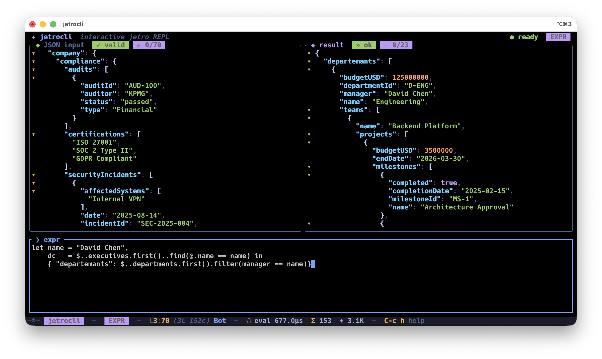

# jetrocli

New to jetro? [**jetro-book**](https://mitghi.github.io/jetro-book/) is the best place to start — guide, tour, and documentation for learning the expression language.

<p align="center">
  
</p>


`jetrocli` is a terminal companion for [jetro](https://github.com/mitghi/jetro), a JSON expression language. It gives you two ways to work with JSON: an interactive TUI for exploring data and a command-line program for processing JSON in scripts, pipes, files, and NDJSON datasets.

Run it directly and it opens a split-pane JSON workbench: paste or load JSON, write a jetro expression, and see the result update live as you type. Pipe or redirect input and it skips the TUI, evaluates once, and prints the result like a regular Unix command.

For large files, `jetrocli` can memory map regular-file input. In `--ndjson` mode it scans one JSON document per line, supports reverse reads from the end of log-style files, and can stop early with `--limit` for bounded queries over very large datasets.

## Features

- **Live evaluation** — expression re-runs on every keystroke.
- **Syntax-highlighted JSON result** with pretty-print (strings, numbers, keys, booleans, null distinct).
- **Structural folding** in JSON editor. Fold any `{…}` / `[…]` block, with gutter triangles (`▾` / `▸`) and inline `⋯ N lines` markers.
- **Schema-aware completion** — suggests fields at the current path, auto-unwraps element fields inside array chains, filters builtins by receiver type.
- **Inline docs pane** next to completions — every jetro builtin ships with signature, summary, and example.
- **Pipe / batch mode without TUI** — when stdin is piped or redirected, jetrocli evaluates once and prints the result directly for shell workflows.
- **File-backed large JSON reads** — regular-file stdin is memory mapped for zero-copy loading instead of forcing the interactive path.
- **Fast NDJSON scans** — `--ndjson` evaluates one JSON document per line from `-i <FILE>` and emits one compact result per row.
- **Reverse NDJSON reads** — `--ndjson -r` scans from tail to head, useful for log-style files where the newest rows matter first.
- **Bounded NDJSON filters** — combine `--ndjson` with `--limit <N>` to stop after the first `N` emitted rows, including reverse scans for "latest matching rows" queries.
- **Emacs-style bindings** throughout (`C-a/C-e`, `C-f/C-b`, `M-f/M-b`, `C-n/C-p`, `C-g`, `C-c` prefix chord).
- **Expression formatter** — breaks long jetro chains onto indented lines (`C-c C-f`).

## Install

### Homebrew (macOS / Linux)

```sh
brew tap mitghi/jetrocli https://github.com/mitghi/homebrew-jetrocli
brew install jetrocli
```

### Shell installer

```sh
curl --proto '=https' --tlsv1.2 -LsSf https://github.com/mitghi/jetrocli/releases/latest/download/jetrocli-installer.sh | sh
```

### From source

```sh
git clone https://github.com/mitghi/jetrocli
cd jetrocli
cargo build --release
```

Binary lands at `target/release/jetrocli`.

## Usage

### Interactive TUI

Default when stdin is a TTY.

```sh
jetrocli                            # sample document
jetrocli -i data.json               # load from file
jetrocli -i data.json -e '$.users'  # pre-fill expression
```

### Pipe / batch mode

When stdin is piped or redirected, TUI is skipped — jetrocli evaluates the expression against stdin and prints the result with `jq`-style colorized JSON (ANSI dropped when stdout not a TTY; respects `NO_COLOR` and `JETROCLI_COLOR=never`).

```sh
echo '{"users":[{"name":"a"},{"name":"b"}]}' | jetrocli '$.users.name'
curl -s api.example.com/data | jetrocli '$.items.first()'
```

With no expression (or empty string), jetrocli just pretty-prints stdin as JSON, like `jq` with no filter:

```sh
cat data.json | jetrocli
echo '{"a":1,"b":[2,3]}' | jetrocli ''
```

When stdin is backed by a regular file (`jetrocli EXPR < big.json`), input is `mmap`'d instead of streamed — zero-copy load for large documents. Real pipes fall back to a buffered read.

### NDJSON mode (file-only)

`--ndjson` switches jetrocli into newline-delimited JSON batch mode: one JSON document per line in `-i <FILE>`, expression evaluated independently per row, one compact result per output line. File input only.

```sh
jetrocli --ndjson -i events.ndjson '$.user'
jetrocli --ndjson -i events.ndjson --limit 100 '$.level == "error"'
jetrocli --ndjson -i app.log -r '$.msg'                    # tail → head
jetrocli --ndjson -i app.log -r --limit 50 '$.msg'         # last 50 matches
```

| Flag | Effect |
| --- | --- |
| `--ndjson` | Enable NDJSON mode. Requires `-i <FILE>` and a non-empty expression. |
| `-r`, `--reverse` | Read file from tail to head via mmap. Requires `--ndjson`. |
| `--limit <N>` | Stop after `N` emitted rows. Requires `--ndjson` and `N ≥ 1`. |
| `--max-line-bytes <BYTES>` | Per-line byte cap. Default 64 MiB. |
| `--reverse-chunk <BYTES>` | Reverse reader chunk size. Tune for very wide rows. |

## Performance

NDJSON mode is built for file-backed batch scans. It memory maps the input file, evaluates the expression independently for each line, and emits compact JSON results without starting the interactive TUI.

The repository includes a reproducible benchmark in `benchmark/`:

```sh
rustc -O benchmark/gen_ndjson.rs -o /tmp/gen_ndjson
/tmp/gen_ndjson /tmp/big.ndjson 1000000000
benchmark/bench.sh
```

`benchmark/bench.sh` compares only the `jetrocli` and [`jaq`](https://github.com/01mf02/jaq) program. The generator writes roughly 1 GB of NDJSON shaped like:

```json
{"id":1,"name":"user_1","attributes":[{"key":"k1","value":"v_1_1"}]}
```

One run on an Apple M1 laptop over 4,764,404 rows produced:

| Query | jetro expression | jaq expression | jetrocli | jaq | Speedup |
| --- | --- | --- | ---: | ---: | ---: |
| Project id | `$.id` | `.id` | 0.72s | 27.89s | **38.7x** |
| Project name | `$.name` | `.name` | 0.30s | 28.99s | **96.6x** |
| Attributes count | `$.attributes.len()` | `.attributes \| length` | 1.52s | 28.19s | **18.5x** |
| Attribute keys list | `$.attributes.map(@.key)` | `.attributes \| map(.key)` | 2.06s | 39.98s | **19.4x** |
| First attr value | `$.attributes.first().value` | `.attributes[0].value` | 0.80s | 29.22s | **36.5x** |
| Last attr value | `$.attributes.last().value` | `.attributes[-1].value` | 1.61s | 29.25s | **18.2x** |
| Uppercase name | `$.name.upper()` | `.name \| ascii_upcase` | 0.41s | 28.42s | **69.3x** |
| `[key,value]` pairs | `$.attributes.map([@.key, @.value])` | `.attributes \| map([.key, .value])` | 2.99s | 54.26s | **18.1x** |
| Count attrs matching `_3` | `$.attributes.filter(@.value.contains("_3")).len()` | `[.attributes[] \| select(.value \| contains("_3"))] \| length` | 1.52s | 48.15s | **31.7x** |
| Object keys | `$.keys()` | `keys` | 1.05s | 28.48s | **27.1x** |

In practice, expect NDJSON mode to be especially strong for field projection, string transforms, row-local indexing, and shallow array operations over large files. Queries that allocate larger derived arrays or inspect more nested values naturally move more bytes and take longer.

## License

MIT
